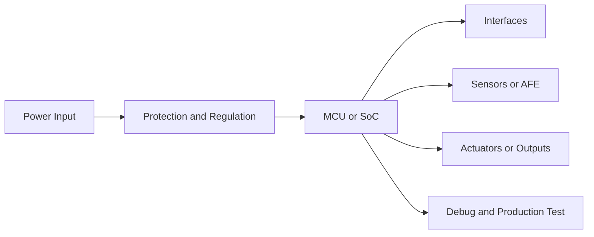

# Hardware Solution Output Template

Use this structure for formal deliverables. Keep sections short when the task is small; do not delete risk and validation sections.

## 1. 方案摘要

- 产品目标：
- 推荐架构：
- 推荐理由：
- 主要风险：
- 下一步动作：

## 2. 需求与假设

| 项目 | 内容 | 状态 |
|---|---|---|
| 使用场景 |  | 已知/假设/待确认 |
| 供电 |  | 已知/假设/待确认 |
| 通信 |  | 已知/假设/待确认 |
| 环境 |  | 已知/假设/待确认 |
| 成本 |  | 已知/假设/待确认 |
| 认证 |  | 已知/假设/待确认 |
| 供应链偏好 | 国产优先/海外主流/混合/无偏好 | 已知/假设/待确认 |

## 3. 用户决策选项

在深入选型前先给用户选择，不要直接输出单一结论。

| 选项 | 核心取向 | 适用条件 | 代价/风险 |
|---|---|---|---|
| A | 低功耗优先 |  |  |
| B | 低成本优先 |  |  |
| C | 快速落地优先 |  |  |
| D | 国产供应链优先 |  |  |

## 4. 架构方案对比

| 方案 | 供应链取向 | 架构 | 关键器件范围 | 优点 | 缺点 | 适用条件 | 结论 |
|---|---|---|---|---|---|---|---|
| A | 国产优先 |  | MCU/电源/通信/传感器 |  |  |  | 推荐/备选/不推荐 |
| B | 海外主流 |  | MCU/电源/通信/传感器 |  |  |  | 推荐/备选/不推荐 |
| C | 混合折中 |  | MCU/电源/通信/传感器 |  |  |  | 推荐/备选/不推荐 |

## 5. 推荐系统框图

用文本框图或 Mermaid 表达模块关系，至少包含主控、电源、通信、传感/执行、调试产测。

## 6. 关键器件建议

| 模块 | 推荐器件/系列 | 国内候选 | 海外候选 | 关键参数 | 替代方案 | 采购链接 | Datasheet 链接 | 封装下载链接 | 主要风险 |
|---|---|---|---|---|---|---|---|---|---|
| 主控 |  |  |  |  |  |  |  |  |  |
| 电源 |  |  |  |  |  |  |  |  |  |
| 通信 |  |  |  |  |  |  |  |  |  |
| 存储 |  |  |  |  |  |  |  |  |  |
| 保护 |  |  |  |  |  |  |  |  |  |

## 7. 接口与信号规划

| 接口 | 信号 | 方向 | 电平 | 速率/电流 | 保护/约束 |
|---|---|---|---|---|---|
|  |  |  |  |  |  |

## 8. 电源树与功耗预算

| 电源轨 | 来源 | 负载 | 估算电流 | 控制方式 | 备注 |
|---|---|---|---|---|---|
|  |  |  |  |  |  |

## 9. PCB 与结构约束

- 层数建议：
- 分区建议：
- 高速/射频/模拟约束：
- 散热约束：
- 连接器和安装约束：
- 测试点和工装约束：

## 10. 固件与调试影响

- 启动和升级：
- 日志和调试接口：
- 低功耗策略：
- 校准和产测：
- 与固件团队的接口约定：

## 11. 风险清单

| 风险 | 影响 | 概率 | 验证动作 | 截止点 |
|---|---|---|---|---|
|  | 成本/周期/可靠性/认证 | 高/中/低 |  | EVT/DVT/PVT |

## 12. 验证计划

| 阶段 | 测试项 | 方法 | 通过标准 |
|---|---|---|---|
| EVT |  |  |  |
| DVT |  |  |  |
| PVT |  |  |  |

## 13. 模块原理图

按功能模块输出原理图级设计片段，标注器件型号、引脚连接、电源轨、关键参数值。

### 13.1 电源模块

- 输入保护与电源路径：
- DCDC/LDO 拓扑与器件：
- 电源轨电压/电流预算：
- 关键元件值与引脚连接：

### 13.2 主控最小系统

- MCU/SoC 型号与封装：
- 晶振/时钟配置：
- 复位与启动电路：
- 去耦与电源引脚连接：

### 13.3 通信接口

- 接口类型与收发器：
- 电平转换与保护：
- 端接与阻抗匹配：
- 连接器引脚定义：

### 13.4 传感/执行前端

- 传感器/执行器型号：
- 模拟前端与信号调理：
- 保护与隔离：
- 关键参数值与引脚连接：
