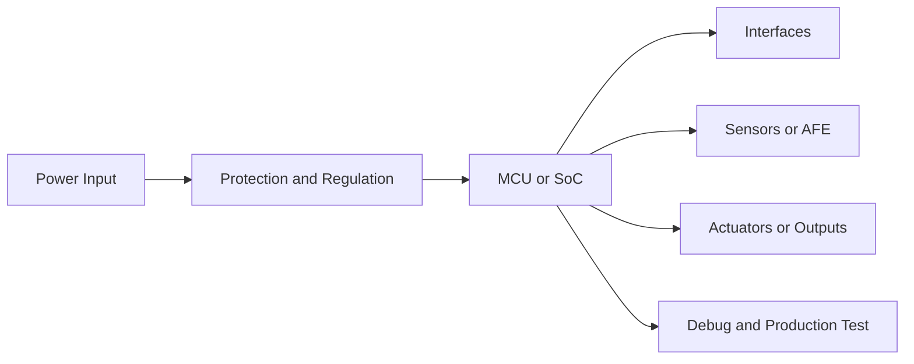

# Hardware Solution Output Template

Use this structure for formal deliverables. Keep sections short when the task is small; do not delete risk and validation sections.

## 1. 方案摘要

- 产品目标：
- 推荐架构：
- 推荐理由：
- 主要风险：
- 下一步动作：

## 2. 需求与假设

| 项目 | 内容 | 状态 |
|---|---|---|
| 使用场景 |  | 已知/假设/待确认 |
| 供电 |  | 已知/假设/待确认 |
| 通信 |  | 已知/假设/待确认 |
| 环境 |  | 已知/假设/待确认 |
| 成本 |  | 已知/假设/待确认 |
| 认证 |  | 已知/假设/待确认 |

## 3. 架构方案对比

| 方案 | 架构 | 优点 | 缺点 | 适用条件 | 结论 |
|---|---|---|---|---|---|
| A |  |  |  |  | 推荐/备选/不推荐 |
| B |  |  |  |  | 推荐/备选/不推荐 |

## 4. 推荐系统框图

用文本框图或 Mermaid 表达模块关系，至少包含主控、电源、通信、传感/执行、调试产测。

## 5. 关键器件建议

| 模块 | 推荐器件/系列 | 关键参数 | 替代方案 | 主要风险 |
|---|---|---|---|---|
| 主控 |  |  |  |  |
| 电源 |  |  |  |  |
| 通信 |  |  |  |  |
| 存储 |  |  |  |  |
| 保护 |  |  |  |  |

## 6. 接口与信号规划

| 接口 | 信号 | 方向 | 电平 | 速率/电流 | 保护/约束 |
|---|---|---|---|---|---|
|  |  |  |  |  |  |

## 7. 电源树与功耗预算

| 电源轨 | 来源 | 负载 | 估算电流 | 控制方式 | 备注 |
|---|---|---|---|---|---|
|  |  |  |  |  |  |

## 8. PCB 与结构约束

- 层数建议：
- 分区建议：
- 高速/射频/模拟约束：
- 散热约束：
- 连接器和安装约束：
- 测试点和工装约束：

## 9. 固件与调试影响

- 启动和升级：
- 日志和调试接口：
- 低功耗策略：
- 校准和产测：
- 与固件团队的接口约定：

## 10. 风险清单

| 风险 | 影响 | 概率 | 验证动作 | 截止点 |
|---|---|---|---|---|
|  | 成本/周期/可靠性/认证 | 高/中/低 |  | EVT/DVT/PVT |

## 11. 验证计划

| 阶段 | 测试项 | 方法 | 通过标准 |
|---|---|---|---|
| EVT |  |  |  |
| DVT |  |  |  |
| PVT |  |  |  |
